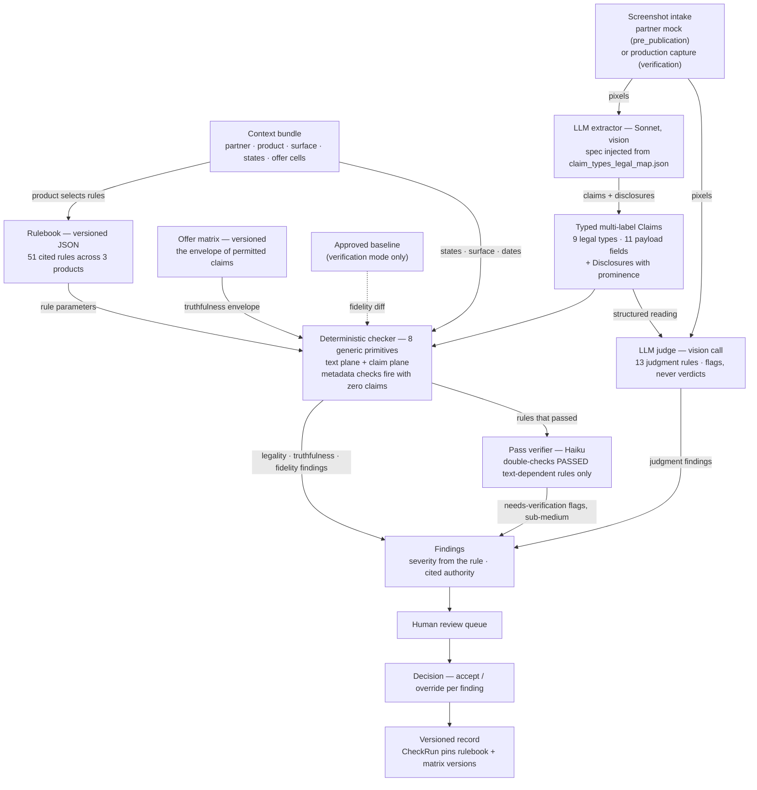
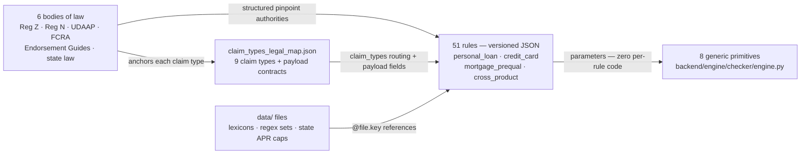

# ClearPath Marketing Compliance

AI-assisted marketing-compliance review platform for a consumer lender (ClearPath Financial: personal loans, credit cards, mortgage prequalification). Partner marketing placements — offer cards, prescreen emails, rate tables — are ingested, their claims and disclosures extracted by a multimodal LLM, checked deterministically against a **cited regulatory rulebook** (legality), a **versioned offer matrix** (truthfulness), and the **approved baseline** (fidelity), then passed through an LLM judgment layer for gray areas. Findings land in a human review queue with accept/override decisions and an immutable, exam-exportable audit trail — replacing the Excel-and-email process that bottlenecks the compliance team.

**Reading order:** the pipeline diagram below, then [Design decisions](#design-decisions) (why the system is shaped this way), then [Repo map](#repo-map) and [Install & run](#install--run). Deep references: [CONTRACTS.md](CONTRACTS.md) (data shapes), [rulebook/README.md](rulebook/README.md) (rule anatomy and the 8 primitives), [rulebook/PROVENANCE.md](rulebook/PROVENANCE.md) (every rule traced to its body of law).

## UI walkthrough

*Placeholder — a screenshot-driven walkthrough of the review queue lands here once the UI freezes.*

## The pipeline

One check engine, multiple entry points: a partner's pre-publication mock and a production capture from a seed account are the same object to the engine — evidence in, findings out.



Stage responsibilities, in one line each:

- **Extractor** (`backend/engine/extractor/extract.py`) — Sonnet vision call; emits typed, located `Claim` and `Disclosure` objects, contract-validated with one corrective retry.
- **Checker** (`backend/engine/checker/engine.py`) — pure functions, no model, no per-rule code; executes 38 deterministic rules through 8 generic primitives on two decision planes (raw normalized text vs. typed claims), plus metadata-plane checks (e.g. state-exclusion leaks) that need no claims at all.
- **Pass verifier** (`backend/engine/checker/verifier.py`) — opt-in Haiku double-check of the rules that *passed*; emits sub-medium flags, never overrides the engine.
- **Judge** (`backend/engine/judge/judge.py`) — one vision call for all 13 `llm_judged` rules; contributes verdict/confidence/reasoning/redline, never severity.
- **Queue & record** (`backend/api/`, `frontend/src/`) — review queue, per-finding accept/override, and a `CheckRun` that records exactly which rulebook and matrix versions were in force (this is what powers the re-validation sweep and the audit trail).

## The rulebook

Rules are versioned data with pinpoint legal citations, not code. Six bodies of law feed 51 rules; the checker's 8 primitives are the only executor.



The deep version — every one of the 51 rules traced to its primary body of law, with severities, check kinds, and secondary anchors — is generated in [rulebook/PROVENANCE.md](rulebook/PROVENANCE.md) (`python rulebook/generate_provenance.py --check` guards staleness). Rule anatomy, the primitive schemas, the severity rubric, and the normalization spec live in [rulebook/README.md](rulebook/README.md).

## Design decisions

Each decision below is stated with its tradeoff and the repo artifact that backs it.

### Screenshots are the canonical evidence

Ads are pixels in reality: what a consumer sees is a render, and the violations that matter most — a post-promo APR buried in an 8px footer, a missing "intro" adjacent to a promo rate — are *prominence* violations that only exist visually. The platform therefore ingests images only (`backend/engine/extractor/extract.py` rejects non-image input), and the HTML files in `fixtures/` exist solely as render sources for the committed PNGs (`fixtures/README.md`). This buys honest prominence assessment (the extractor judges relative size, position, contrast as a genuine visual task) at the cost of transcription fidelity: the literal claim text is bounded by what the vision model reads off the image, so every downstream matcher is transcription-tolerant by spec (dash/quote/whitespace normalization, documented in `extract.py` and `eval.py`). A side benefit for evaluation: HTML comments annotating planted violations can never leak into the evidence, because screenshots cannot contain comments by construction.

### Claim types are legal entities, not surface forms

The nine-value `ClaimType` taxonomy names bodies of law, not phrasings: `triggering_term` is Reg Z 1026.24(d)/1026.16(b), `approval_or_prequalification` is FCRA 603(l) + Reg N 1014.3(q), and so on ([CONTRACTS.md](CONTRACTS.md), `rulebook/claim_types_legal_map.json`). The taxonomy is shared across all three products — *products select rules, never types* — so the extractor classifies once against a stable legal ontology and the rulebook does product-specific subscription. Claims are multi-label: "0% intro APR for 15 months" is one statement embodying two legal categories (`promotional_or_introductory` + `triggering_term`), so it is one `Claim` listing both, with a payload that is the union of both contracts (contracts amendments #4/#5 in CONTRACTS.md). The tradeoff is a residual bucket (`general_udaap_representation`) that absorbs everything the specific regimes don't cover — acceptable because UDAAP genuinely *is* the legal residual, and the map documents near-miss examples to keep the boundary sharp.

### The payload trim: 36 fields → 11, by demand ledger

The claim payloads originally declared ~36 typed fields; 11 survive, and the justification is written down, not asserted. Two consumption ledgers enumerate every field each decision layer actually reads: the checker reads exactly 11 payload fields (`backend/engine/checker/CONSUMED_FIELDS.md`, per-rule) and the judge reads zero — it reasons over verbatim claim text (`backend/engine/judge/CONSUMED_FIELDS.md`). Everything unread was cut, and the ledgers explain *why* the unread list was so large: token-bound rules decide on the text plane, so payload fields shadowing text checks (`has_intro_word`, `is_deferred_interest`, …) duplicated decisions the text already makes. The governance rule going forward: **a field returns only with a named consumer** — a specific rule predicate or judge input that reads it — never speculatively (CONTRACTS.md, amendment #5b). The cost is that a future rule wanting a trimmed field must re-add it through a contract change; that friction is the point.

### One source of truth, generated twice

There are no hand-synced mirrors anywhere in the type chain. `rulebook/claim_types_legal_map.json` is the single definition of claim types and their payload fields; the pydantic payload models are *generated from it at import time* (`_build_payload_models` in `backend/contracts.py` — edit the map, never the models); the TypeScript types are *generated from the pydantic models* by `scripts/generate_contracts_ts.py`, with a staleness gate (`--check`) wired into `smoke.sh` and enforced by `backend/test_contracts_codegen.py`. A drifted mirror is therefore a build failure, not a latent bug. The tradeoff is indirection — a reviewer must know the map is the source — which [CONTRACTS.md](CONTRACTS.md) states in its first paragraph.

### Rules are data; eight primitives are the only code

A rule is a **(scope, ONE decidable predicate, structured pinpoint authorities, severity)** quadruple, bounded by the one-finding test: if articulating a violation needs two explanations, that is two rules (`rulebook/README.md`, "What is a rule"). Rules carry `parameters` from a closed vocabulary of 8 generic check primitives (`phrase_prohibited`, `phrase_conditional`, `trigger_requires_disclosures`, `element_required`, `proximity_required`, `ground_truth_consistency`, `numeric_cap_by_state`, `composite_all` — the last is the one documented addition beyond the mandated seven); `backend/engine/checker/engine.py` executes primitives against parameters and contains zero per-rule code. Adding a rule is a JSON entry plus review: `rulebook/validate_rulebook.py` enforces the schemas, data-reference resolution, citation indexes, and manifest counts, and `generate_provenance.py` fails loudly if a new authority fits no known family. Authorities are structured and honest about regime — the Endorsement Guides are an `agency_guide`, substantiation doctrine is `enforcement_doctrine`, not "a regulation." Severity is editorial (the law assigns none), so it is anchored to a written rubric with enforcement precedent — false "pre-approved" is critical because of FTC v. Credit Karma ($3M), stale partner rates because of CFPB v. Amerisave ($19.3M) (`rulebook/README.md`, severity rubric).

### The determinism audit: what does the law bind on?

Every deterministic rule declares `binding: token | concept` — an audit of whether the *law itself* mandates literal words or a meaning. For token-bound rules (APR labeling, "intro" adjacency, "if paid in full", the literal word "fixed", the prescreen heading), a normalized string check **is** the legal test, so the rule legitimately decides on the text plane. For concept-bound rules (guaranteed-approval paraphrases, fee misrepresentation, urgency), a phrase list can never be the legal test — those decisions run on typed claims (`decision_inputs: claim_plane`), and any raw-text patterns on them are demoted to `safety_net_patterns`: secondary detectors whose solo hits emit needs-verification findings *capped below medium severity*, never the rule's full severity (`rulebook/README.md`). The invalid combination `concept` + `text_plane` fails validation outright — a concept rule deciding on raw text would be smuggling a completeness claim. "Deterministic" here means the *decision* is a pure function over detected inputs; detection completeness for concepts is a separately measured property (the fixtures eval), never an assumed one.

### Three models, three jobs — and why passes get verified, not fails

Sonnet classifies, code decides, Haiku verifies. Classification against a nine-type legal ontology is the genuinely hard step, so extraction runs on Sonnet (measured: Haiku scored 0.92 recall with known weaknesses); the verdicts themselves are free and auditable because they are deterministic code; and pass-verification is a far easier task — checking supplied text against an explicit rule description — so it runs on Haiku (`backend/engine/checker/verifier.py`, "Model tiering rationale"; model choices also documented in `backend/test_e2e_pipeline.py`). The asymmetry is deliberate: **a fail already produces a finding a human will see, so a false fail gets caught in review; a false pass is silent.** The verifier therefore double-checks only the rules that produced *no* finding, restricted to text-dependent rules (pure metadata-plane arithmetic has nothing textual to second-guess), and it only flags — sub-medium, additive, never overriding the engine. Its documented limit: it catches mangled-extraction misses, not wholly-unextracted content — text that never reached the engine never reaches the verifier either.

### The judge sees pixels, and it never decides severity

Net impression is a visual doctrine — whether a headline promise contradicts fine print depends on what a consumer actually confronts — so the judge receives the screenshot itself as a vision block, alongside (not instead of) the extractor's structured reading (`backend/engine/judge/judge.py`). That gives it independence from extraction: a claim the extractor mangled is still on the pixels. The judge handles exactly what a regex cannot — standards, not rules — across the 13 `llm_judged` rules, in one batched structured-output call. Its output discipline is strict: the model contributes violated/confidence/reasoning/evidence/suggested-redline; **severity comes from the rule, never from the model**, and low-confidence findings are still emitted because flagging uncertain gray areas for humans *is* the job. All prompt material (judge focus, violation examples, compliant contrast, verbatim citation quotes) is loaded from the rulebook at runtime — never hardcoded.

### Enforcement layering, discovered empirically

The clean design — one typed closed-union schema enforcing the full payload contract at decode time — was tried and rejected by the API itself: at ~36 optional fields the compiled constrained-decoding grammar exceeded the API's cap, twice, with and without `Literal` vocabularies (400 "compiled grammar is too large"; request id recorded in the `extract.py` docstring). Enforcement therefore layers: **decode** guarantees claim/disclosure type enums and structure (always compiles); **validation plus one corrective retry** enforces payload keys, types, requiredness, and vocabularies (`validate_claim_payload`, with the exact validation error fed back to the model); the **prompt** carries vocabularies and requiredness emphasis. The same finding shaped the judge, whose output schema is deliberately small (6 fields, one 3-value Literal) to stay far under the cap. This is weaker than pure decode-time typing — the retry can fail — but the residual failure mode is measured, and the payload trim to 11 fields attacked the root.

### Three layers of ground truth

Truthfulness is not one question, so there are three baselines ([CONTRACTS.md](CONTRACTS.md)). The **offer matrix** (`fixtures/offer_matrix.csv`, versioned) is the *envelope* of what ClearPath may claim through a partner — every advertised rate, term, amount, and fee must exist inside a referenced, unexpired cell (`ground_truth_consistency` rules like PL-TRUTH-001/CC-TRUTH-001). The **served API response** is the personalized ground truth for what a specific consumer was actually offered — the deterministic mock prequal engine at `backend/prequal/` prices a *point inside the matrix envelope* by construction and echoes `offer_cell_id` + matrix version, so a personalized rendering can be verified against exactly what was served. The **approved baseline** answers fidelity: in verification mode, a production capture is diffed against the approved submission it should match (`baseline_submission_id` is the join key), catching drift like a floor rate quietly changed after approval. Pinning the matrix version in every `CheckRun` is what makes the re-validation sweep possible: change the matrix, re-run stale check runs, catch the placements that just went false — the Amerisave failure mode, automated.

### Measured, not assumed

Every model-dependent property has a measurement harness. The fixture set plants specific violations and commits a ground-truth answer key (`fixtures/expected_findings.json`, invariants enforced by `fixtures/validate_fixtures.py`: literal claim texts, coverage, compliant-fixture emptiness); the extractor eval (`python -m backend.engine.extractor.eval`) scores claim recall, type accuracy (multi-label membership), and payload value accuracy against it, with per-miss diagnostics that distinguish transcription drift from true misses. Live results on the default Sonnet model: 1.0 recall / 1.0 type accuracy / clean value grading across all fixture screenshots. `backend/test_e2e_pipeline.py` then tests what no stubbed suite can — that the four stages actually *compose* — driving real screenshots through the public interface only and grading subset-wise against the key; it caught a real cross-stage defect (extraction intermittently mistyping fine-print repayment terms, causing the checker to raise a HIGH false positive on a compliant creative), which is documented in the test itself as a known real defect rather than papered over. Known limitations are recorded where they live: state APR caps simplified for demo (`rulebook/README.md`), transcription-bounded text fidelity (`extract.py`).

## Repo map

| Path | What it is |
|---|---|
| `backend/contracts.py`, [CONTRACTS.md](CONTRACTS.md) | Pydantic source of truth for every shape; payload models generated from the legal map at import |
| `backend/engine/extractor/` | Sonnet vision extraction + the scored eval harness (`eval.py`) |
| `backend/engine/checker/` | Deterministic engine (8 primitives), pass verifier, demand ledger (`CONSUMED_FIELDS.md`) |
| `backend/engine/judge/` | LLM judgment layer + its demand ledger |
| `backend/prequal/` | Deterministic mock prequal API (served-response ground truth) |
| `backend/api/`, `backend/db/`, `backend/ingest/` | Review-queue/decision endpoints, SQLite models + seed, CSV ingestion |
| `backend/test_e2e_pipeline.py` | Live black-box tests across all four stages |
| `rulebook/` | 51 cited rules as versioned JSON + validator, provenance generator, shared `data/` files |
| `fixtures/` | Placement mocks (HTML sources + canonical PNG renders), offer matrix, submission manifest, answer key |
| `frontend/` | React (Vite) review UI; `src/contracts.gen.ts` is generated, never hand-edited |
| `scripts/generate_contracts_ts.py` | Contracts codegen with `--check` staleness gate |

## Install & run

```bash
# backend
python3 -m venv .venv
.venv/bin/pip install -r backend/requirements.txt
cp .env.example .env          # add your ANTHROPIC_API_KEY
.venv/bin/python -m backend.db.seed         # seed SQLite from fixtures (resets schema)
PORT=5001 .venv/bin/python -m backend.app   # 5000 is taken by macOS AirPlay

# frontend (dev, separate terminal — proxies /api to :5001)
cd frontend && npm install && npm run dev

# or serve the built frontend from Flask directly
cd frontend && npm run build && cd .. && PORT=5001 .venv/bin/python -m backend.app
```

Smoke test: `./smoke.sh` (boots Flask, asserts `/api/health`, and runs the contracts-codegen freshness gate).

Validation and tests:

```bash
python rulebook/validate_rulebook.py               # rulebook schema + citation + manifest checks
python rulebook/generate_provenance.py --check     # provenance map staleness guard
python3 fixtures/validate_fixtures.py              # answer-key invariants
.venv/bin/python -m pytest backend                 # per-stage suites (models stubbed, no key needed)
```

The live suites — `backend/test_e2e_pipeline.py` and the extractor eval (`python -m backend.engine.extractor.eval`) — call the Anthropic API and are skipped unless `ANTHROPIC_API_KEY` resolves (env var or repo-root `.env`). A full e2e run makes 6 model calls (~$0.10–0.20).

## Deployment

One service: Flask serves the built React bundle (no CORS, one URL). `Procfile` runs `gunicorn backend.app:app` for Railway/Fly-style hosts; SQLite is seeded from `fixtures/` via `python -m backend.db.seed`, so ephemeral disks reset to a clean demo state on redeploy. Deployed-URL specifics land here with the final deploy pass.
