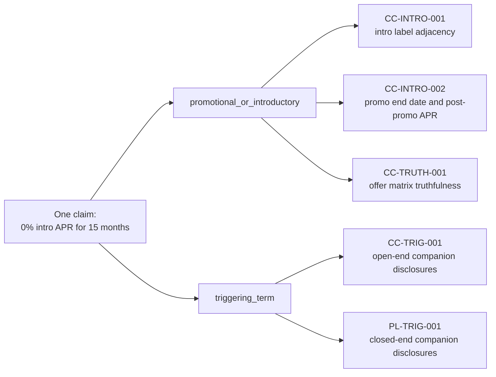
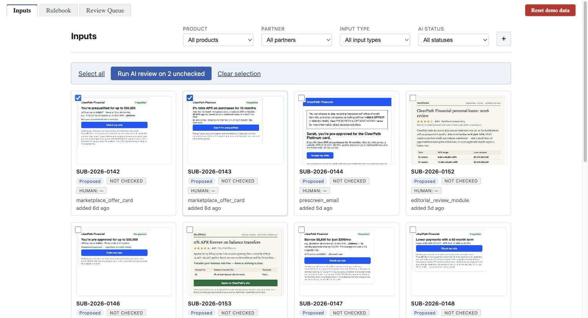
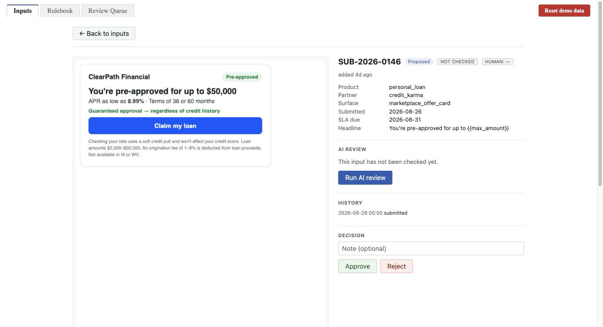
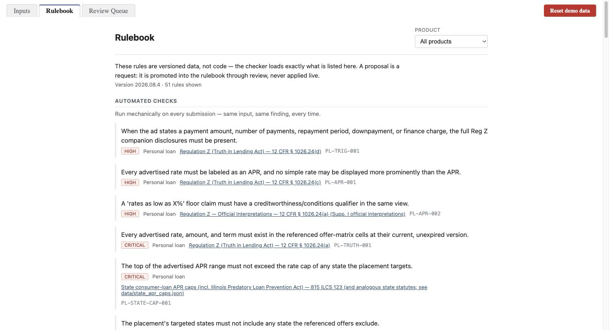
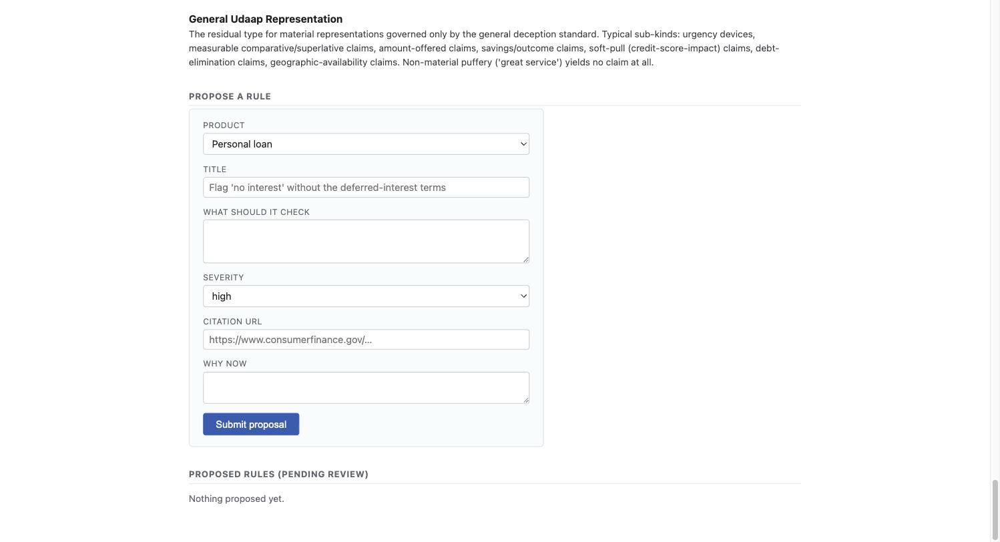
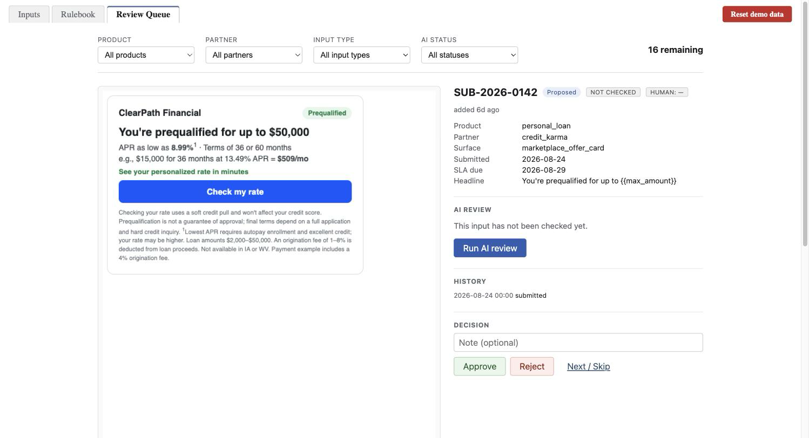
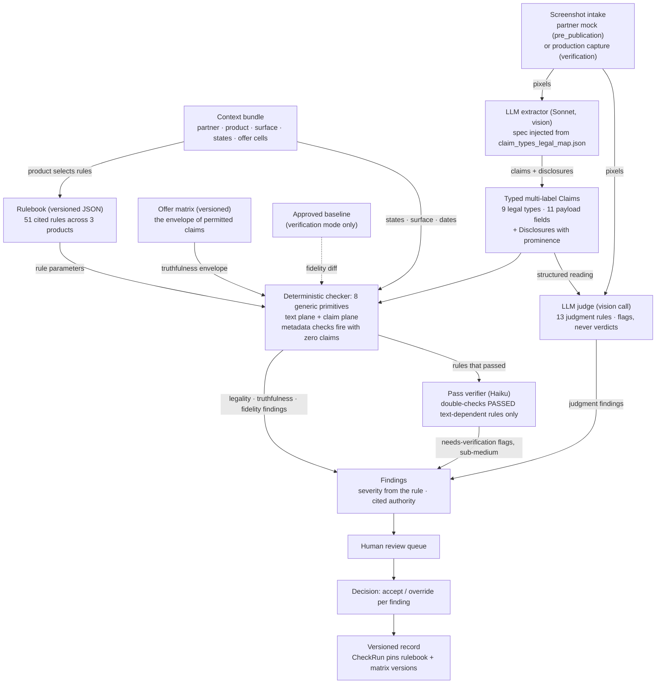

# ClearPath Marketing Compliance

AI-assisted marketing-compliance review platform for a consumer lender (ClearPath Financial: personal loans, credit cards, mortgage prequalification). Partner marketing placements (offer cards, prescreen emails, rate tables) are ingested, their claims and disclosures extracted by a multimodal LLM, checked deterministically against a **cited regulatory rulebook** (legality), a **versioned offer matrix** (truthfulness), and the **approved baseline** (fidelity), then passed through an LLM judgment layer for gray areas. Findings land in a human review queue with accept/override decisions and an immutable, exam-exportable audit trail, replacing the Excel-and-email process that bottlenecks the compliance team.

The core data relationship in one glance: claims are multi-label, and each legal type activates its own set of checks.



**Reading order:** the pipeline diagram below, then [Design decisions](#design-decisions) (why the system is shaped this way), then [Repo map](#repo-map) and [Install & run](#install--run). Deep references: [CONTRACTS.md](CONTRACTS.md) (data shapes), [rulebook/README.md](rulebook/README.md) (rule anatomy and the 8 primitives), [rulebook/PROVENANCE.md](rulebook/PROVENANCE.md) (every rule traced to its body of law).

## UI walkthrough

How a compliance reviewer moves through the app, in the order the workflow intends. The demo below is seeded from `fixtures/`.

Work starts on the **Inputs** tab. Every partner placement is a card: the creative itself, a lifecycle chip (proposed mock or production capture), an AI chip carrying the verdict of the latest automated check, and a human chip carrying the reviewer's decision. Four dropdowns filter the grid by product, partner, input type, and AI status. Ticking card checkboxes raises a batch bar, and one click runs the AI review on every unchecked selection; here two cards are selected and the bar offers to run them both.



Clicking a card opens it. The evidence screenshot sits on the left, exactly as captured; the right rail stacks the metadata (product, partner, surface, submitted date, SLA due date, headline), the AI REVIEW panel, the submission history, and the decision controls. Below is SUB-2026-0146, a personal-loan offer card whose creative promises guaranteed approval regardless of credit history, one of the planted violations in the demo set, shown fresh from intake before its first AI run. Run AI review sends it through the pipeline; each finding that comes back renders under an attention banner with the rule id that fired, a severity chip, a plain-English summary, a suggested redline when the judge offers one, and a link to the exact legal citation.



The **Rulebook** tab renders the checker's actual loaded rulebook: versioned data, not code, with the version in force and the rule count pinned at the top. Each rule is one plain-English sentence plus a severity chip, the product it applies to, its rule id, and a pinpoint citation linking to the regulation. Automated checks and judgment-based gray-area checks sit in separate sections, and the nine claim types that route extracted statements to rules are documented on the same page.



At the bottom of the same tab sits propose-a-rule: a reviewer drafts the rule (product, title, what it should check, severity, citation URL, why now) and the proposal lands in a pending-review list. A proposal never applies live; it is promoted into the rulebook through review.



The **Review Queue** tab is the working view: instead of another list, it drops the reviewer straight into the first undecided submission, with the same four filters to scope the cycle and a live count of how many remain. The decision bar takes an optional note plus Approve or Reject, and Next / Skip passes without deciding. A decision removes the item from the queue and auto-advances to the next undecided one, so the whole queue can be cleared without ever going back to the grid.



## The pipeline

One check engine, multiple entry points: a partner's pre-publication mock and a production capture from a seed account are the same object to the engine. Evidence in, findings out.



Stage responsibilities, in one line each:

- **Extractor** (`backend/engine/extractor/extract.py`): Sonnet vision call; emits typed, located `Claim` and `Disclosure` objects, contract-validated with one corrective retry.
- **Checker** (`backend/engine/checker/engine.py`): pure functions, no model, no per-rule code; executes 38 deterministic rules through 8 generic primitives on two decision planes (raw normalized text vs. typed claims), plus metadata-plane checks (e.g. state-exclusion leaks) that need no claims at all.
- **Pass verifier** (`backend/engine/checker/verifier.py`): opt-in Haiku double-check of the rules that *passed*; emits sub-medium flags, never overrides the engine.
- **Judge** (`backend/engine/judge/judge.py`): one vision call for all 13 `llm_judged` rules; contributes verdict/confidence/reasoning/redline, never severity.
- **Queue & record** (`backend/api/`, `frontend/src/`): review queue, per-finding accept/override, and a `CheckRun` that records exactly which rulebook and matrix versions were in force (this is what powers the re-validation sweep and the audit trail).

## The rulebook

Rules are versioned data with pinpoint legal citations, not code. Six bodies of law feed 51 rules; the checker's 8 primitives are the only executor.


The deep version, with every one of the 51 rules traced to its primary body of law plus severities, check kinds, and secondary anchors, is generated in [rulebook/PROVENANCE.md](rulebook/PROVENANCE.md) (`python rulebook/generate_provenance.py --check` guards staleness). Rule anatomy, the primitive schemas, the severity rubric, and the normalization spec live in [rulebook/README.md](rulebook/README.md).

## Design decisions

Each decision below is stated with its tradeoff and the repo artifact that backs it.

### Screenshots are the canonical evidence

Screenshots are the only truly generalizable evidence across every partner surface: there is no shared DOM, feed, or API between a marketplace's logged-in app, a prescreen email, and an affiliate landing page, but every placement on every surface can be captured as an image. Pixels are the one intake contract that works for all of them. They are also what ads *are* in reality: what a consumer sees is a render, and the violations that matter most (a post-promo APR buried in an 8px footer, a missing "intro" adjacent to a promo rate) are *prominence* violations that only exist visually. The platform therefore ingests images only (`backend/engine/extractor/extract.py` rejects non-image input), and the HTML files in `fixtures/` exist solely as render sources for the committed PNGs (`fixtures/README.md`). This buys honest prominence assessment (the extractor judges relative size, position, contrast as a genuine visual task) at the cost of transcription fidelity: the literal claim text is bounded by what the vision model reads off the image, so every downstream matcher is transcription-tolerant by spec (dash/quote/whitespace normalization, documented in `extract.py` and `eval.py`). A side benefit for evaluation: HTML comments annotating planted violations can never leak into the evidence, because screenshots cannot contain comments by construction.

### Claim types are legal entities, not surface forms

The nine-value `ClaimType` taxonomy names bodies of law, not phrasings: `triggering_term` is Reg Z 1026.24(d)/1026.16(b), `approval_or_prequalification` is FCRA 603(l) + Reg N 1014.3(q), and so on ([CONTRACTS.md](CONTRACTS.md), `rulebook/claim_types_legal_map.json`). Each claim type maps to *multiple* rules: different legal entities carry different legal duties, so classification is the routing step that decides which checks the law requires. Identifying a statement as a `triggering_term` is what obligates the Reg Z companion-disclosure checks; recognizing an `approval_or_prequalification` claim is what activates the FCRA firm-offer and Reg N checks; a `rate_or_apr` claim pulls in the truthfulness and APR-labeling rules. The taxonomy is shared across all three products (*products select rules, never types*), so the extractor classifies once against a stable legal ontology and the rulebook does product-specific subscription. Claims are multi-label: "0% intro APR for 15 months" is one statement embodying two legal categories (`promotional_or_introductory` + `triggering_term`), so it is one `Claim` listing both, with a payload that is the union of both contracts (contracts amendments #4/#5 in CONTRACTS.md). The tradeoff is a residual bucket (`general_udaap_representation`) that absorbs everything the specific regimes don't cover. That is acceptable because UDAAP genuinely *is* the legal residual, and the map documents near-miss examples to keep the boundary sharp.

### Rules are data; eight primitives are the only code

A rule is a **(scope, ONE decidable predicate, structured pinpoint authorities, severity)** quadruple, bounded by the one-finding test: if articulating a violation needs two explanations, that is two rules (`rulebook/README.md`, "What is a rule"). Rules carry `parameters` from a closed vocabulary of 8 generic check primitives (`phrase_prohibited`, `phrase_conditional`, `trigger_requires_disclosures`, `element_required`, `proximity_required`, `ground_truth_consistency`, `numeric_cap_by_state`, `composite_all`; the last is the one documented addition beyond the mandated seven); `backend/engine/checker/engine.py` executes primitives against parameters and contains zero per-rule code. Adding a rule is a JSON entry plus review: `rulebook/validate_rulebook.py` enforces the schemas, data-reference resolution, citation indexes, and manifest counts, and `generate_provenance.py` fails loudly if a new authority fits no known family. Authorities are structured and honest about regime: the Endorsement Guides are an `agency_guide`, substantiation doctrine is `enforcement_doctrine`, not "a regulation." Severity is editorial (the law assigns none), so it is anchored to a written rubric with enforcement precedent: false "pre-approved" is critical because of FTC v. Credit Karma ($3M), stale partner rates because of CFPB v. Amerisave ($19.3M) (`rulebook/README.md`, severity rubric).

### The determinism audit: what does the law bind on?

Every deterministic rule declares `binding: token | concept`, an audit of whether the *law itself* mandates literal words or a meaning. For token-bound rules (APR labeling, "intro" adjacency, "if paid in full", the literal word "fixed", the prescreen heading), a normalized string check **is** the legal test, so the rule legitimately decides on the text plane. For concept-bound rules (guaranteed-approval paraphrases, fee misrepresentation, urgency), a phrase list can never be the legal test, so those decisions run on typed claims (`decision_inputs: claim_plane`), and any raw-text patterns on them are demoted to `safety_net_patterns`: secondary detectors whose solo hits emit needs-verification findings *capped below medium severity*, never the rule's full severity (`rulebook/README.md`). The invalid combination `concept` + `text_plane` fails validation outright: a concept rule deciding on raw text would be smuggling a completeness claim. "Deterministic" here means the *decision* is a pure function over detected inputs; detection completeness for concepts is a separately measured property (the fixtures eval), never an assumed one.

### Three models, three jobs, and why passes get verified, not fails

Sonnet classifies, code decides, Haiku verifies. Classification against a nine-type legal ontology is the genuinely hard step, so extraction runs on Sonnet (measured: Haiku scored 0.92 recall with known weaknesses); the verdicts themselves are free and auditable because they are deterministic code; and pass-verification is a far easier task (checking supplied text against an explicit rule description), so it runs on Haiku (`backend/engine/checker/verifier.py`, "Model tiering rationale"; model choices also documented in `backend/test_e2e_pipeline.py`). The asymmetry is deliberate: **a fail already produces a finding a human will see, so a false fail gets caught in review; a false pass is silent.** The verifier therefore double-checks only the rules that produced *no* finding, restricted to text-dependent rules (pure metadata-plane arithmetic has nothing textual to second-guess), and it only flags: sub-medium, additive, never overriding the engine. Its documented limit: it catches mangled-extraction misses, not wholly-unextracted content; text that never reached the engine never reaches the verifier either.

### Two kinds of checks: deterministic versus gray area

Every rule declares its kind, and the kind decides who gets to say "violation." The 38 `deterministic` rules are versioned JSON parameters executed by the eight generic primitives in `backend/engine/checker/engine.py`: they fire mechanically, and the same input always produces the same finding. These are the rules where the legal test genuinely *is* mechanical. PL-TRIG-001 (`rulebook/personal_loan.json`) encodes Reg Z 12 CFR 1026.24(d): stating a payment amount or repayment period is a triggering term, and any one present obligates a fixed set of companion disclosures, so presence and absence settle the question. PL-STATE-CAP-001 is arithmetic: the top of the advertised APR range compared against the rate cap of every state the placement targets (`rulebook/data/state_apr_caps.json`). Deterministic verdicts are therefore free, instant, and auditable; their *passes* also get a cheap Haiku double-check from the pass verifier of the previous section, but the decision itself never leaves code.

The 13 `llm_judged` rules exist because some law is written as a standard, not a rule, and no phrase list or regex can decide a standard. The judge evaluates all of them in one vision call that sees the actual screenshot alongside the extractor's structured reading (`backend/engine/judge/judge.py`). Take PL-JUDGE-001, the net-impression rule: under the CFPB/FTC standard it quotes verbatim, deception turns on the overall impression the entire ad leaves on a reasonable consumer, so "Get $25,000 at 8.99% APR, money in your account tomorrow" can be deceptive even when fine print admits that 8.99% goes only to the top 5% of applicants and most rates run 18 to 36%, because whether fine print cures a headline depends on prominence, placement, and contradiction, none of which a substring match can see. Output discipline is strict: the model contributes violated/confidence/reasoning/evidence/suggested-redline; **severity comes from the rule, never from the model**; judge findings are flags for human review, never verdicts; and low-confidence findings are still emitted, because surfacing uncertain gray areas *is* the job. All prompt material (judge focus, violation examples, compliant contrasts, verbatim citation quotes) loads from the rulebook at runtime, never hardcoded. The split is the honesty policy: where the law binds on words or numbers the check is code, and where the law imposes judgment the model flags and a human decides.

### Two kinds of placements, two sources of truth

A lender's partner marketing runs two fundamentally different kinds of placement, and each needs its own ground truth. **Broad placements** (rate tables, offer cards, prescreen emails shown to a wide audience) advertise the *bounds* of what ClearPath offers: "APR as low as 8.99%". In the real world that envelope is a document the lender hands its partners, and it is not internal trivia; it ends up public. The Upstart ↔ Credit Karma promotion agreement on the public record moves exactly this object: its Exhibit C has rate updates flowing to the marketplace as an **"offer matrix" via shared Excel file** ([SEC EX-10.15](https://www.sec.gov/Archives/edgar/data/1647639/000119312520285895/d867925dex1015.htm)), and Credit Karma publishes the resulting lender-supplied APR ranges with "as of" dates on its [public disclosure pages](https://www.creditkarma.com/about/personal-loan-disclaimers). Our versioned offer matrix (`fixtures/offer_matrix.csv`) plays that role: every advertised rate, term, amount, and fee must land inside a referenced, unexpired cell (`ground_truth_consistency` rules like PL-TRUTH-001/CC-TRUTH-001).

**Personalized placements** are the other kind: on a logged-in platform like Credit Karma, the ad's terms come from a real-time API call to the lender's engine, priced for the specific member viewing it. We built a deterministic mock of that engine (`backend/prequal/`) to emulate this flow: it prices a point *inside the matrix envelope* by construction and echoes `offer_cell_id` + matrix version, so a personalized rendering can be verified against exactly what was served to that user. This is the API-side reconciliation that proved the FTC's Credit Karma case. Verification mode adds one more comparison: a production capture is diffed against the approved baseline it should match (`baseline_submission_id`), and because every `CheckRun` pins the matrix version in force, a matrix change can trigger a re-validation sweep that catches placements that just went false. That is the Amerisave failure mode, automated.

## Repo map

| Path | What it is |
|---|---|
| `backend/contracts.py`, [CONTRACTS.md](CONTRACTS.md) | Pydantic source of truth for every shape; payload models generated from the legal map at import |
| `backend/engine/extractor/` | Sonnet vision extraction + the scored eval harness (`eval.py`) |
| `backend/engine/checker/` | Deterministic engine (8 primitives), pass verifier, demand ledger (`CONSUMED_FIELDS.md`) |
| `backend/engine/judge/` | LLM judgment layer + its demand ledger |
| `backend/prequal/` | Deterministic mock prequal API (served-response ground truth) |
| `backend/api/`, `backend/db/`, `backend/ingest/` | Review-queue/decision endpoints, SQLite models + seed, CSV ingestion |
| `backend/test_e2e_pipeline.py` | Live black-box tests across all four stages |
| `rulebook/` | 51 cited rules as versioned JSON + validator, provenance generator, shared `data/` files |
| `fixtures/` | Placement mocks (HTML sources + canonical PNG renders), offer matrix, submission manifest, answer key |
| `frontend/` | React (Vite) review UI; `src/contracts.gen.ts` is generated, never hand-edited |
| `scripts/generate_contracts_ts.py` | Contracts codegen with `--check` staleness gate |

## Install & run

```bash
# backend
python3 -m venv .venv
.venv/bin/pip install -r backend/requirements.txt
cp .env.example .env          # add your ANTHROPIC_API_KEY
.venv/bin/python -m backend.db.seed         # seed SQLite from fixtures (resets schema)
PORT=5001 .venv/bin/python -m backend.app   # 5000 is taken by macOS AirPlay

# frontend (dev, separate terminal; proxies /api to :5001)
cd frontend && npm install && npm run dev

# or serve the built frontend from Flask directly
cd frontend && npm run build && cd .. && PORT=5001 .venv/bin/python -m backend.app
```

Smoke test: `./smoke.sh` (boots Flask, asserts `/api/health`, and runs the contracts-codegen freshness gate).

Validation and tests:

```bash
python rulebook/validate_rulebook.py               # rulebook schema + citation + manifest checks
python rulebook/generate_provenance.py --check     # provenance map staleness guard
python3 fixtures/validate_fixtures.py              # answer-key invariants
.venv/bin/python -m pytest backend                 # per-stage suites (models stubbed, no key needed)
```

The live suites, `backend/test_e2e_pipeline.py` and the extractor eval (`python -m backend.engine.extractor.eval`), call the Anthropic API and are skipped unless `ANTHROPIC_API_KEY` resolves (env var or repo-root `.env`). A full e2e run makes 6 model calls (~$0.10-0.20).

## Deployment

One service: Flask serves the built React bundle (no CORS, one URL). `Procfile` runs `gunicorn backend.app:app` for Railway/Fly-style hosts; SQLite is seeded from `fixtures/` via `python -m backend.db.seed`, so ephemeral disks reset to a clean demo state on redeploy. Deployed-URL specifics land here with the final deploy pass.
