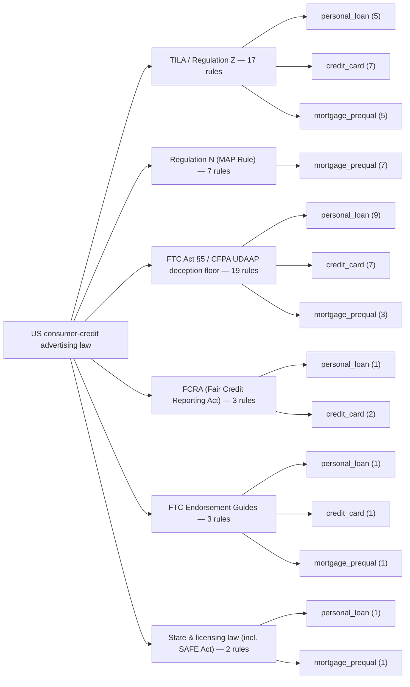

# Rulebook Provenance Map

**Where does each rule come from?** Every rule in rulebook v2026.08.3 traces to one
of six top-level bodies of law (its *primary* family — the first entry in its
`authorities` list); rules resting on multiple bodies are cross-referenced. This file
is **generated** by `rulebook/generate_provenance.py` — do not hand-edit (see Maintenance).

## Map

### Overview

### Full trace

Every rule as a leaf under its primary family's product cluster; dashed edges mark
cross-family secondary anchors (multi-authority rules).

```mermaid
flowchart LR
    LAW["US consumer-credit advertising law"]
    LAW --> regz["TILA / Regulation Z — 17 rules"]
    LAW --> regn["Regulation N (MAP Rule) — 7 rules"]
    LAW --> udaap["FTC Act §5 / CFPA UDAAP deception floor — 19 rules"]
    LAW --> fcra["FCRA (Fair Credit Reporting Act) — 3 rules"]
    LAW --> endorse["FTC Endorsement Guides — 3 rules"]
    LAW --> state["State & licensing law (incl. SAFE Act) — 2 rules"]
    regz --> regz_personal_loan["personal_loan (5)"]
    regz --> regz_credit_card["credit_card (7)"]
    regz --> regz_mortgage_prequal["mortgage_prequal (5)"]
    regz_personal_loan --> r_PL_TRIG_001["PL-TRIG-001"]
    regz_personal_loan --> r_PL_APR_001["PL-APR-001"]
    regz_personal_loan --> r_PL_APR_002["PL-APR-002"]
    regz_personal_loan --> r_PL_TRUTH_001["PL-TRUTH-001"]
    regz_personal_loan --> r_PL_JUDGE_002["PL-JUDGE-002"]
    regz_credit_card --> r_CC_TRIG_001["CC-TRIG-001"]
    regz_credit_card --> r_CC_INTRO_001["CC-INTRO-001"]
    regz_credit_card --> r_CC_INTRO_002["CC-INTRO-002"]
    regz_credit_card --> r_CC_DEFER_001["CC-DEFER-001"]
    regz_credit_card --> r_CC_FIXED_001["CC-FIXED-001"]
    regz_credit_card --> r_CC_SCHUMER_001["CC-SCHUMER-001"]
    regz_credit_card --> r_CC_TRUTH_001["CC-TRUTH-001"]
    regz_mortgage_prequal --> r_MTG_TI_001["MTG-TI-001"]
    regz_mortgage_prequal --> r_MTG_RATE_001["MTG-RATE-001"]
    regz_mortgage_prequal --> r_MTG_DEBT_001["MTG-DEBT-001"]
    regz_mortgage_prequal --> r_MTG_TRUTH_001["MTG-TRUTH-001"]
    regz_mortgage_prequal --> r_MTG_COUNSEL_001["MTG-COUNSEL-001"]
    regn --> regn_mortgage_prequal["mortgage_prequal (7)"]
    regn_mortgage_prequal --> r_MTG_REGN_001["MTG-REGN-001"]
    regn_mortgage_prequal --> r_MTG_FIXED_001["MTG-FIXED-001"]
    regn_mortgage_prequal --> r_MTG_GOV_001["MTG-GOV-001"]
    regn_mortgage_prequal --> r_MTG_JUDGE_001["MTG-JUDGE-001"]
    regn_mortgage_prequal --> r_XP_PREQ_002_mortgage_prequal["XP-PREQ-002-mortgage_prequal"]
    regn_mortgage_prequal --> r_XP_COMP_003_mortgage_prequal["XP-COMP-003-mortgage_prequal"]
    regn_mortgage_prequal --> r_XP_ODDS_005_mortgage_prequal["XP-ODDS-005-mortgage_prequal"]
    udaap --> udaap_personal_loan["personal_loan (9)"]
    udaap --> udaap_credit_card["credit_card (7)"]
    udaap --> udaap_mortgage_prequal["mortgage_prequal (3)"]
    udaap_personal_loan --> r_PL_STATE_EXCL_001["PL-STATE-EXCL-001"]
    udaap_personal_loan --> r_PL_FEE_001["PL-FEE-001"]
    udaap_personal_loan --> r_PL_JUDGE_001["PL-JUDGE-001"]
    udaap_credit_card --> r_CC_JUDGE_001["CC-JUDGE-001"]
    udaap_personal_loan --> r_XP_UDAAP_001_personal_loan["XP-UDAAP-001-personal_loan"]
    udaap_credit_card --> r_XP_UDAAP_001_credit_card["XP-UDAAP-001-credit_card"]
    udaap_mortgage_prequal --> r_XP_UDAAP_001_mortgage_prequal["XP-UDAAP-001-mortgage_prequal"]
    udaap_personal_loan --> r_XP_PREQ_002_personal_loan["XP-PREQ-002-personal_loan"]
    udaap_credit_card --> r_XP_PREQ_002_credit_card["XP-PREQ-002-credit_card"]
    udaap_personal_loan --> r_XP_COMP_003_personal_loan["XP-COMP-003-personal_loan"]
    udaap_credit_card --> r_XP_COMP_003_credit_card["XP-COMP-003-credit_card"]
    udaap_personal_loan --> r_XP_URG_004_personal_loan["XP-URG-004-personal_loan"]
    udaap_credit_card --> r_XP_URG_004_credit_card["XP-URG-004-credit_card"]
    udaap_mortgage_prequal --> r_XP_URG_004_mortgage_prequal["XP-URG-004-mortgage_prequal"]
    udaap_personal_loan --> r_XP_ODDS_005_personal_loan["XP-ODDS-005-personal_loan"]
    udaap_credit_card --> r_XP_ODDS_005_credit_card["XP-ODDS-005-credit_card"]
    udaap_personal_loan --> r_XP_SOFT_007_personal_loan["XP-SOFT-007-personal_loan"]
    udaap_credit_card --> r_XP_SOFT_007_credit_card["XP-SOFT-007-credit_card"]
    udaap_mortgage_prequal --> r_XP_SOFT_007_mortgage_prequal["XP-SOFT-007-mortgage_prequal"]
    fcra --> fcra_personal_loan["personal_loan (1)"]
    fcra --> fcra_credit_card["credit_card (2)"]
    fcra_personal_loan --> r_PL_BADGE_001["PL-BADGE-001"]
    fcra_credit_card --> r_CC_PRESCREEN_001["CC-PRESCREEN-001"]
    fcra_credit_card --> r_CC_BADGE_001["CC-BADGE-001"]
    endorse --> endorse_personal_loan["personal_loan (1)"]
    endorse --> endorse_credit_card["credit_card (1)"]
    endorse --> endorse_mortgage_prequal["mortgage_prequal (1)"]
    endorse_personal_loan --> r_XP_TEST_006_personal_loan["XP-TEST-006-personal_loan"]
    endorse_credit_card --> r_XP_TEST_006_credit_card["XP-TEST-006-credit_card"]
    endorse_mortgage_prequal --> r_XP_TEST_006_mortgage_prequal["XP-TEST-006-mortgage_prequal"]
    state --> state_personal_loan["personal_loan (1)"]
    state --> state_mortgage_prequal["mortgage_prequal (1)"]
    state_personal_loan --> r_PL_STATE_CAP_001["PL-STATE-CAP-001"]
    state_mortgage_prequal --> r_MTG_NMLS_001["MTG-NMLS-001"]
    udaap -.-> r_PL_APR_002
    udaap -.-> r_PL_TRUTH_001
    udaap -.-> r_PL_BADGE_001
    udaap -.-> r_PL_JUDGE_002
    udaap -.-> r_CC_BADGE_001
    udaap -.-> r_CC_TRUTH_001
    regz -.-> r_MTG_FIXED_001
    regn -.-> r_MTG_TI_001
    regn -.-> r_MTG_DEBT_001
    udaap -.-> r_MTG_TRUTH_001
    udaap -.-> r_XP_PREQ_002_mortgage_prequal
    udaap -.-> r_XP_COMP_003_mortgage_prequal
    regn -.-> r_XP_URG_004_mortgage_prequal
    udaap -.-> r_XP_ODDS_005_mortgage_prequal
    udaap -.-> r_XP_TEST_006_personal_loan
    udaap -.-> r_XP_TEST_006_credit_card
    regn -.-> r_XP_TEST_006_mortgage_prequal
    classDef detToken fill:#2e6e4e,stroke:#1e4e36,color:#f2f2f2
    classDef detConcept fill:#39588c,stroke:#27406a,color:#f2f2f2
    classDef judged fill:#6d4f8c,stroke:#503a6b,color:#f2f2f2
    class r_PL_APR_001,r_CC_INTRO_001,r_CC_INTRO_002,r_CC_DEFER_001,r_CC_FIXED_001,r_MTG_RATE_001,r_MTG_COUNSEL_001,r_MTG_FIXED_001,r_CC_PRESCREEN_001,r_MTG_NMLS_001 detToken
    class r_PL_TRIG_001,r_PL_APR_002,r_PL_TRUTH_001,r_CC_TRIG_001,r_CC_SCHUMER_001,r_CC_TRUTH_001,r_MTG_TI_001,r_MTG_DEBT_001,r_MTG_TRUTH_001,r_MTG_REGN_001 detConcept
    class r_MTG_GOV_001,r_XP_PREQ_002_mortgage_prequal,r_PL_STATE_EXCL_001,r_PL_FEE_001,r_XP_UDAAP_001_personal_loan,r_XP_UDAAP_001_credit_card,r_XP_UDAAP_001_mortgage_prequal,r_XP_PREQ_002_personal_loan,r_XP_PREQ_002_credit_card,r_XP_URG_004_personal_loan detConcept
    class r_XP_URG_004_credit_card,r_XP_URG_004_mortgage_prequal,r_XP_SOFT_007_personal_loan,r_XP_SOFT_007_credit_card,r_XP_SOFT_007_mortgage_prequal,r_PL_BADGE_001,r_CC_BADGE_001,r_PL_STATE_CAP_001 detConcept
    class r_PL_JUDGE_002,r_MTG_JUDGE_001,r_XP_COMP_003_mortgage_prequal,r_XP_ODDS_005_mortgage_prequal,r_PL_JUDGE_001,r_CC_JUDGE_001,r_XP_COMP_003_personal_loan,r_XP_COMP_003_credit_card,r_XP_ODDS_005_personal_loan,r_XP_ODDS_005_credit_card judged
    class r_XP_TEST_006_personal_loan,r_XP_TEST_006_credit_card,r_XP_TEST_006_mortgage_prequal judged
```

*Legend: green = deterministic (token-bound), blue = deterministic (concept-bound),
purple = LLM-judged. Solid edges = primary authority; dashed = secondary anchor.*

## TILA / Regulation Z

17 rules anchored here as primary authority.

| rule_id | product | pinpoint citation | severity | check_kind | what it checks | also anchored in |
|---|---|---|---|---|---|---|
| PL-TRIG-001 | personal_loan | 12 CFR § 1026.24(d) | high | deterministic | When the ad states a payment amount, number of payments, repayment period, downpayment, or finance charge, the full Reg Z companion disclosures must be present. | — |
| PL-APR-001 | personal_loan | 12 CFR § 1026.24(c) | high | deterministic | Every advertised rate must be labeled as an APR, and no simple rate may be displayed more prominently than the APR. | — |
| PL-APR-002 | personal_loan | 12 CFR § 1026.24(a) (Supp. I official interpretations) | high | deterministic | A 'rates as low as X%' floor claim must have a creditworthiness/conditions qualifier in the same view. | FTC Act §5 / CFPA UDAAP deception floor (12 U.S.C. § 5531) |
| PL-TRUTH-001 | personal_loan | 12 CFR § 1026.24(a) | critical | deterministic | Every advertised rate, amount, and term must exist in the referenced offer-matrix cells at their current, unexpired version. | FTC Act §5 / CFPA UDAAP deception floor (12 U.S.C. § 5531) |
| PL-JUDGE-002 | personal_loan | 12 CFR § 1026.24(a) (Supp. I official interpretations) | medium | llm_judged | Is the payment example representative (mid-range rate, typical amount, fees included) or cherry-picked at the unattainable floor? | FTC Act §5 / CFPA UDAAP deception floor (12 U.S.C. § 5531) |
| CC-TRIG-001 | credit_card | 12 CFR § 1026.16(b) | high | deterministic | When a card ad states a rate or fee claim — including negative claims like 'no annual fee' — the Reg Z open-end companion disclosures must be present. | — |
| CC-INTRO-001 | credit_card | 12 CFR § 1026.16(g)(3) | high | deterministic | The word 'intro' or 'introductory' must sit immediately next to every appearance of a promotional rate. | — |
| CC-INTRO-002 | credit_card | 12 CFR § 1026.16(g)(4) | high | deterministic | The promo end date and the rate that applies afterwards must appear close to the first mention of the promotional rate. | — |
| CC-DEFER-001 | credit_card | 12 CFR § 1026.16(h) | critical | deterministic | A deferred-interest offer must say 'if paid in full' immediately next to each 'no interest' statement and disclose that interest is charged retroactively from the purchase date if the balance is not paid off in time. | — |
| CC-FIXED-001 | credit_card | 12 CFR § 1026.16(f) | high | deterministic | 'Fixed' may not describe a card rate whose referenced offer is variable, unless a fixed period is stated. | — |
| CC-SCHUMER-001 | credit_card | 12 CFR § 1026.60 | high | deterministic | Card solicitations (direct mail and email) must present or unavoidably link the standardized Schumer box rate/fee table. | — |
| CC-TRUTH-001 | credit_card | 12 CFR § 1026.16 | critical | deterministic | Every advertised card number — intro APR, intro period, post-promo range, annual fee — must match the referenced offer-matrix cells at their current, unexpired version. | FTC Act §5 / CFPA UDAAP deception floor (12 U.S.C. § 5531) |
| MTG-TI-001 | mortgage_prequal | 12 CFR § 1026.24(f) | high | deterministic | Any monthly-payment figure on mortgage creative requires the disclosure that the payment excludes taxes and insurance. | Regulation N (MAP Rule) (12 CFR § 1014.3(f)) |
| MTG-RATE-001 | mortgage_prequal | 12 CFR § 1026.24(c) | high | deterministic | Mortgage rates must be labeled as APR, and any simple interest rate shown must sit with the APR at equal or lesser prominence. | — |
| MTG-DEBT-001 | mortgage_prequal | 12 CFR § 1026.24(i)(5) | critical | deterministic | Debt-elimination language ('debt-free', 'eliminate your debt') is banned on dwelling-secured product marketing. | Regulation N (MAP Rule) (12 CFR § 1014.3(m)) |
| MTG-TRUTH-001 | mortgage_prequal | 12 CFR § 1026.24(a) | critical | deterministic | Advertised mortgage rates and APRs must match the current offer-matrix window (mortgage pricing reprices ~daily) and must never conflate a simple rate with the APR. | FTC Act §5 / CFPA UDAAP deception floor (12 U.S.C. § 5531) |
| MTG-COUNSEL-001 | mortgage_prequal | 12 CFR § 1026.24(i)(6) | medium | deterministic | A for-profit lender may not call itself or its staff 'counselors' in mortgage marketing. | — |

*Also a secondary anchor for:* MTG-FIXED-001

## Regulation N (MAP Rule)

7 rules anchored here as primary authority.

| rule_id | product | pinpoint citation | severity | check_kind | what it checks | also anchored in |
|---|---|---|---|---|---|---|
| MTG-REGN-001 | mortgage_prequal | 12 CFR § 1014.3(q) | critical | deterministic | Mortgage prequal creative may never use 'pre-approved', 'guaranteed', or any other approval-certainty language, regardless of offer flags. | — |
| MTG-FIXED-001 | mortgage_prequal | 12 CFR § 1014.3 | critical | deterministic | 'Fixed' may not appear on a placement whose referenced mortgage offer carries a variable/adjustable rate. | TILA / Regulation Z (12 CFR § 1026.24(i)(1)) |
| MTG-GOV-001 | mortgage_prequal | 12 CFR § 1014.3(n) | high | deterministic | Government-program vocabulary (FHA, HUD, VA, 'official notice') is flagged unless the offer is verified as a genuine government-program loan with no implied agency affiliation. | — |
| MTG-JUDGE-001 | mortgage_prequal | 12 CFR § 1014.3(q) | high | llm_judged | Is the prequalification framing honest about what it is? | — |
| XP-PREQ-002-mortgage_prequal | mortgage_prequal | 12 CFR § 1014.3(q) | high | deterministic | Whenever mortgage creative says 'prequalified', an approval-not-guaranteed qualifier must be present. | FTC Act §5 / CFPA UDAAP deception floor (15 U.S.C. § 45(a)) |
| XP-COMP-003-mortgage_prequal | mortgage_prequal | 12 CFR § 1014.3 | high | llm_judged | Superlative/comparative claims ('lowest rates', 'best mortgage'): is there plausible current-market substantiation? | FTC Act §5 / CFPA UDAAP deception floor (15 U.S.C. § 45(a)) |
| XP-ODDS-005-mortgage_prequal | mortgage_prequal | 12 CFR § 1014.3(q) | critical | llm_judged | Any approval-odds framing on mortgage prequal creative: Reg N 1014.3(q) bans misrepresenting approval likelihood outright — treat numeric odds claims on mortgage as presumptively non-compliant, not merely unsubstantiated. | FTC Act §5 / CFPA UDAAP deception floor (15 U.S.C. § 45(a)) |

*Also a secondary anchor for:* MTG-TI-001, MTG-DEBT-001, XP-URG-004-mortgage_prequal, XP-TEST-006-mortgage_prequal

## FTC Act §5 / CFPA UDAAP deception floor

19 rules anchored here as primary authority.

| rule_id | product | pinpoint citation | severity | check_kind | what it checks | also anchored in |
|---|---|---|---|---|---|---|
| PL-STATE-EXCL-001 | personal_loan | 12 U.S.C. § 5531 | high | deterministic | The placement's targeted states must not include any state the referenced offers exclude. | — |
| PL-FEE-001 | personal_loan | 12 U.S.C. § 5531 | critical | deterministic | A 'no fees' style claim is a violation when the referenced offer deducts an origination fee from loan proceeds, unless the fee is disclosed right next to the claim. | — |
| PL-JUDGE-001 | personal_loan | 12 U.S.C. § 5531 | medium | llm_judged | Net impression: does the headline promise contradict or bury material limits that only appear in fine print (rate floor availability, fee deduction, approval uncertainty)? | — |
| CC-JUDGE-001 | credit_card | 12 U.S.C. § 5531 | medium | llm_judged | Rewards/benefit claims ('unlimited cash back', 'best travel card'): are earn rates, caps, and redemption limits disclosed or contradicted? | — |
| XP-UDAAP-001-personal_loan | personal_loan | 12 U.S.C. § 5531 | critical | deterministic | Approval-certainty phrases like 'guaranteed approval' or 'no credit check' are banned outright wherever any underwriting exists. | — |
| XP-UDAAP-001-credit_card | credit_card | 12 U.S.C. § 5531 | critical | deterministic | Approval-certainty phrases like 'guaranteed approval' or 'no credit check' are banned outright wherever any underwriting exists. | — |
| XP-UDAAP-001-mortgage_prequal | mortgage_prequal | 12 U.S.C. § 5531 | critical | deterministic | Approval-certainty phrases like 'guaranteed approval' or 'no credit check' are banned outright wherever any underwriting exists. | — |
| XP-PREQ-002-personal_loan | personal_loan | 15 U.S.C. § 45(a) | high | deterministic | Whenever the creative says 'prequalified', an approval-not-guaranteed qualifier must be present. | — |
| XP-PREQ-002-credit_card | credit_card | 15 U.S.C. § 45(a) | high | deterministic | Whenever the creative says 'prequalified', an approval-not-guaranteed qualifier must be present. | — |
| XP-COMP-003-personal_loan | personal_loan | 15 U.S.C. § 45(a) | high | llm_judged | Superlative/comparative claims ('lowest rates', 'best loan', 'beats any offer'): is there plausible current-market substantiation, or is this a measurable claim presented without basis? | — |
| XP-COMP-003-credit_card | credit_card | 15 U.S.C. § 45(a) | high | llm_judged | Superlative/comparative claims ('lowest rates', 'best card', 'highest cash back'): is there plausible current-market substantiation, or is this a measurable claim presented without basis? | — |
| XP-URG-004-personal_loan | personal_loan | 12 U.S.C. § 5531 | medium | deterministic | Urgency devices ('act now', 'expires today') are flagged unless the referenced offer really expires when the ad implies. | — |
| XP-URG-004-credit_card | credit_card | 12 U.S.C. § 5531 | medium | deterministic | Urgency devices ('act now', 'expires today') are flagged unless the referenced offer really expires when the ad implies. | — |
| XP-URG-004-mortgage_prequal | mortgage_prequal | 12 U.S.C. § 5531 | medium | deterministic | Urgency devices on mortgage creative are flagged unless tied to a real pricing window; official/final-notice framing also implicates Reg N. | Regulation N (MAP Rule) (12 CFR § 1014.3(n)) |
| XP-ODDS-005-personal_loan | personal_loan | 15 U.S.C. § 45(a) | high | llm_judged | Approval-odds claims ('90% approval odds', 'outstanding approval odds'): does the integration type support them (lender-decisioned prequal vs partner odds model)? | — |
| XP-ODDS-005-credit_card | credit_card | 15 U.S.C. § 45(a) | high | llm_judged | Approval-odds claims ('90% approval odds', 'excellent approval odds'): does the integration type support them? | — |
| XP-SOFT-007-personal_loan | personal_loan | 12 U.S.C. § 5531 | medium | deterministic | A 'won't affect your credit score' claim is flagged until the flow is verified as soft-pull end-to-end before final application. | — |
| XP-SOFT-007-credit_card | credit_card | 12 U.S.C. § 5531 | medium | deterministic | A 'won't affect your credit score' claim is flagged until the flow is verified as soft-pull end-to-end before final application. | — |
| XP-SOFT-007-mortgage_prequal | mortgage_prequal | 12 U.S.C. § 5531 | medium | deterministic | A 'won't affect your credit score' claim on mortgage creative is flagged until the described stage is verified as soft-pull (mortgage flows mix soft-pull prequal and hard-pull preapproval). | — |

*Also a secondary anchor for:* PL-APR-002, PL-TRUTH-001, PL-BADGE-001, PL-JUDGE-002, CC-BADGE-001, CC-TRUTH-001, MTG-TRUTH-001, XP-PREQ-002-mortgage_prequal, XP-COMP-003-mortgage_prequal, XP-ODDS-005-mortgage_prequal, XP-TEST-006-personal_loan, XP-TEST-006-credit_card

## FCRA (Fair Credit Reporting Act)

3 rules anchored here as primary authority.

| rule_id | product | pinpoint citation | severity | check_kind | what it checks | also anchored in |
|---|---|---|---|---|---|---|
| PL-BADGE-001 | personal_loan | 15 U.S.C. § 1681a(l) | critical | deterministic | 'Pre-approved' may appear only when the referenced offer is a true FCRA firm offer of credit. | FTC Act §5 / CFPA UDAAP deception floor (15 U.S.C. § 45(a)) |
| CC-PRESCREEN-001 | credit_card | 15 U.S.C. § 1681m(d) | critical | deterministic | A prescreened firm-offer creative must carry the FCRA opt-out notices in their mandated form and placement. | — |
| CC-BADGE-001 | credit_card | 15 U.S.C. § 1681a(l) | critical | deterministic | 'Pre-approved' may appear only when the referenced card offer is a true FCRA firm offer of credit. | FTC Act §5 / CFPA UDAAP deception floor (15 U.S.C. § 45(a)) |

## FTC Endorsement Guides

3 rules anchored here as primary authority.

| rule_id | product | pinpoint citation | severity | check_kind | what it checks | also anchored in |
|---|---|---|---|---|---|---|
| XP-TEST-006-personal_loan | personal_loan | 16 CFR § 255.1(a) | medium | llm_judged | Testimonials/endorsements: is any material connection (payment, free product, affiliate bounty) disclosed unavoidably in the same medium as the claim? | FTC Act §5 / CFPA UDAAP deception floor (15 U.S.C. § 45(a)) |
| XP-TEST-006-credit_card | credit_card | 16 CFR § 255.1(d) | medium | llm_judged | Testimonials/endorsements: is any material connection (payment, free product, affiliate bounty) disclosed unavoidably in the same medium as the claim? | FTC Act §5 / CFPA UDAAP deception floor (15 U.S.C. § 45(a)) |
| XP-TEST-006-mortgage_prequal | mortgage_prequal | 16 CFR § 255.1(d) | medium | llm_judged | Testimonials/endorsements on mortgage creative: material-connection disclosure, generally-achievable results, and Reg N overlay — testimonial content may not carry misrepresentations the lender could not make directly (rates, savings, approval). | Regulation N (MAP Rule) (12 CFR § 1014.3) |

## State & licensing law (incl. SAFE Act)

2 rules anchored here as primary authority.

| rule_id | product | pinpoint citation | severity | check_kind | what it checks | also anchored in |
|---|---|---|---|---|---|---|
| PL-STATE-CAP-001 | personal_loan | 815 ILCS 123 (and analogous state statutes; see data/state_apr_caps.json) | critical | deterministic | The top of the advertised APR range must not exceed the rate cap of any state the placement targets. | — |
| MTG-NMLS-001 | mortgage_prequal | 10 VAC 5-160-60 | high | deterministic | Every piece of mortgage creative must display the company's NMLS identifier. | — |

## Claim-type taxonomy anchors

The ClaimType enum (see `claim_types_legal_map.json`) anchors to the same families:

| claim_type | primary family | pinpoint citation |
|---|---|---|
| triggering_term | TILA / Regulation Z | 12 CFR § 1026.24(d) |
| rate_or_apr | TILA / Regulation Z | 12 CFR § 1026.24(b)-(c) |
| promotional_or_introductory | TILA / Regulation Z | 12 CFR § 1026.16(g)-(h) |
| fixed_rate_representation | TILA / Regulation Z | 12 CFR § 1026.16(f) |
| approval_or_prequalification | FCRA (Fair Credit Reporting Act) | 15 U.S.C. § 1681a(l) |
| fee_or_cost | TILA / Regulation Z | 12 CFR § 1026.4 |
| endorsement_or_testimonial | FTC Endorsement Guides | 16 CFR § 255.0 |
| government_affiliation | Regulation N (MAP Rule) | 12 CFR § 1014.3(n) |
| general_udaap_representation | FTC Act §5 / CFPA UDAAP deception floor | 12 U.S.C. § 5531 |

## Stats

- Generated from rulebook_version: **2026.08.3**
- Total rules: **51**
- Rules per family (primary): TILA / Regulation Z 17, Regulation N (MAP Rule) 7, FTC Act §5 / CFPA UDAAP deception floor 19, FCRA (Fair Credit Reporting Act) 3, FTC Endorsement Guides 3, State & licensing law (incl. SAFE Act) 2
- Rules per product: personal_loan 17, credit_card 17, mortgage_prequal 17
- Multi-authority rules: **37** of 51
- Deterministic binding split: token 10 / concept 28 (llm_judged: 13)

## Maintenance

- **This file is generated. Do not hand-edit.** Regenerate with:
  `python rulebook/generate_provenance.py`
- CI / reviewer guard: `python rulebook/generate_provenance.py --check` exits
  non-zero when this file is stale relative to the rule files.
- **When a NEW body of law enters the rulebook:** the generator fails loudly
  ("authority fits no canonical family") until the new authority is placed in
  `family_of()` / `FAMILIES` in `generate_provenance.py`. That failure is the
  mechanism that keeps this map complete — do not suppress it.
